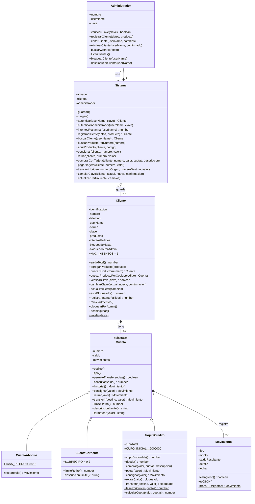

# Diagrama UML de clases — MOVA

Modelo de clases real del proyecto (carpeta `js/models` y `js/services`).
Imagen: [`uml/mova-uml.png`](uml/mova-uml.png) · Diagrama original de la fase de diseño: [`uml/mova-uml-original.pdf`](uml/mova-uml-original.pdf)

## Pilares de POO que muestra el diagrama

- **Abstracción:** `Cuenta` es una clase abstracta (no se puede instanciar directamente).
- **Encapsulamiento:** saldo, movimientos, clave e intentos son atributos privados (`-`); solo se cambian con métodos.
- **Herencia:** `CuentaAhorros`, `CuentaCorriente` y `TarjetaCredito` extienden `Cuenta`.
- **Polimorfismo:** `retirar()` y `transferir()` se comportan distinto según el producto (interés en ahorros, sobregiro en corriente, bloqueo en tarjeta).
