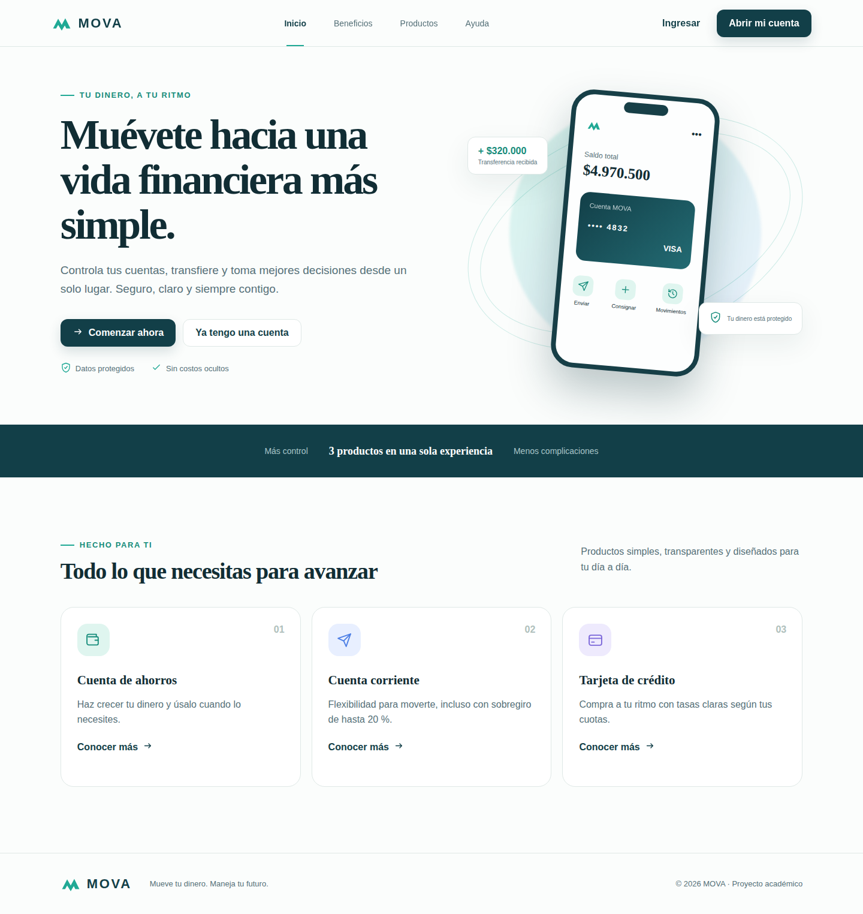
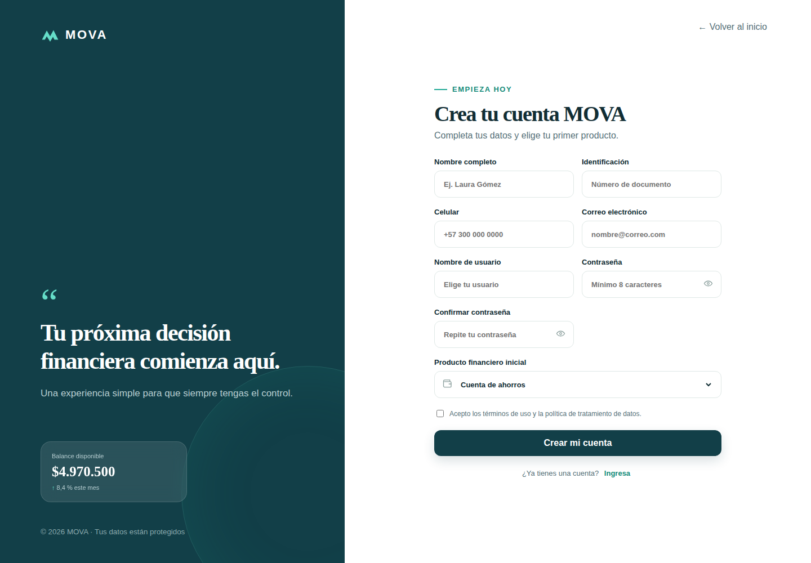
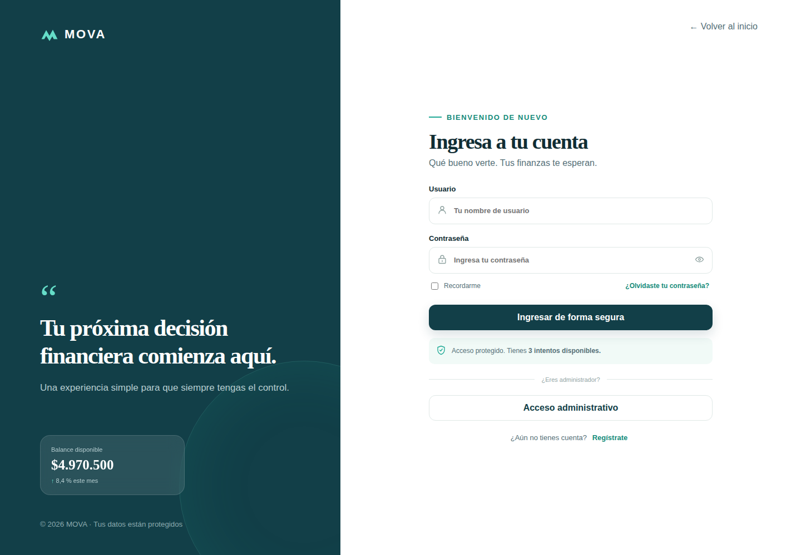
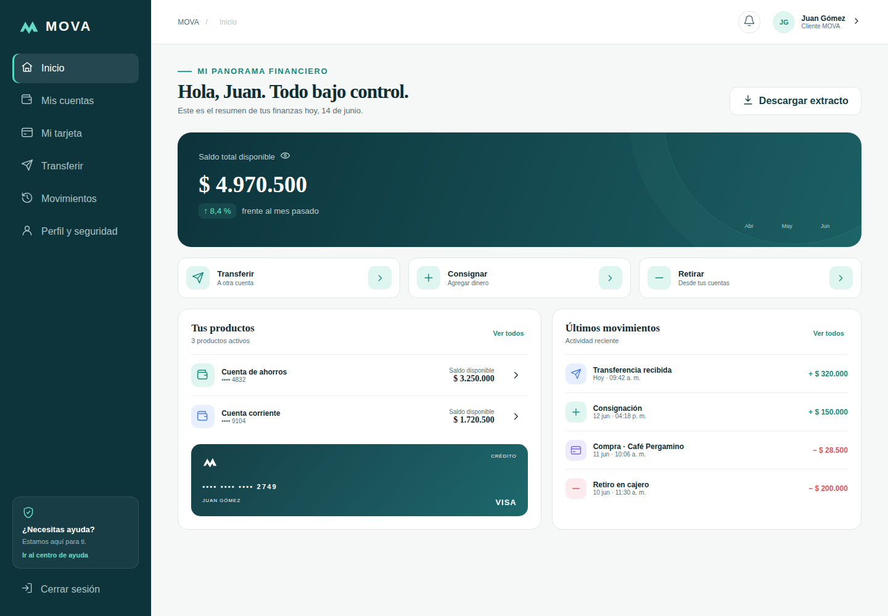
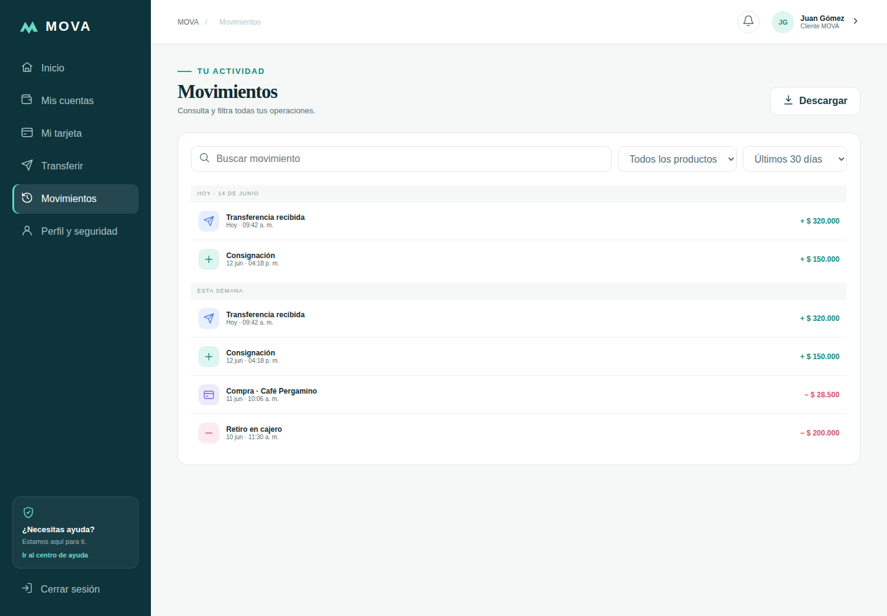
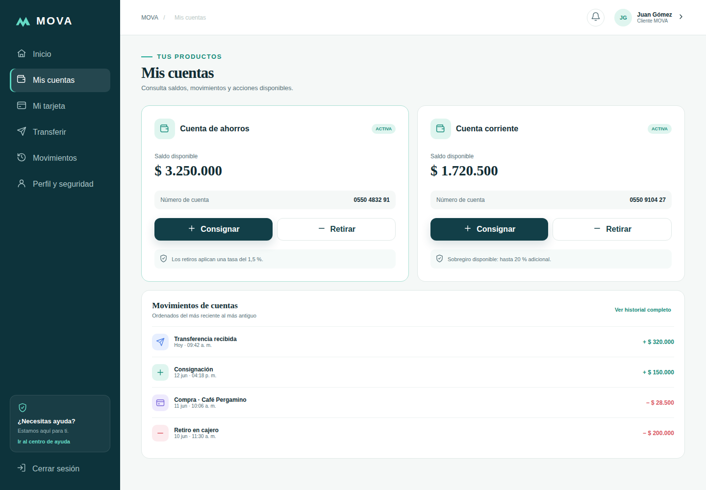
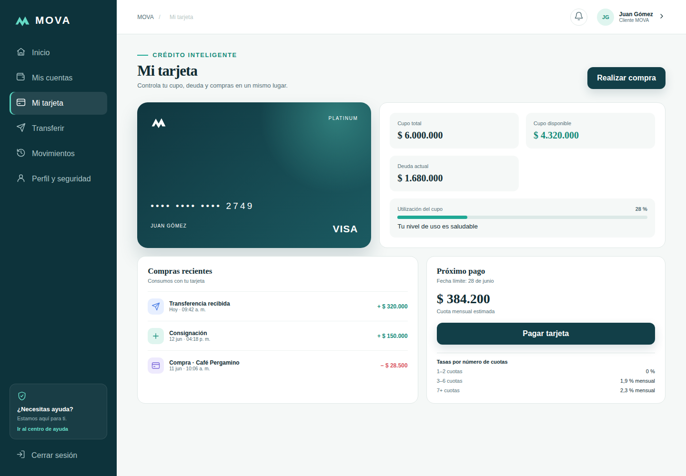
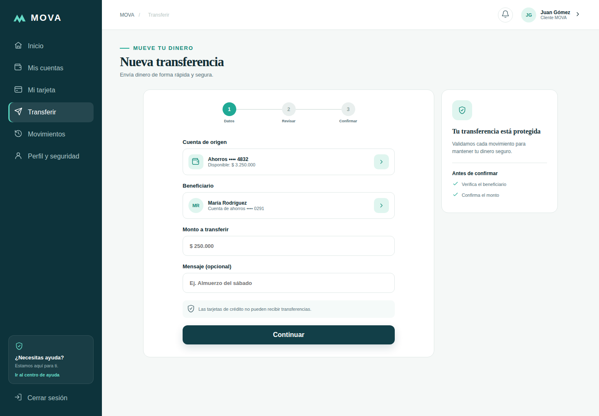
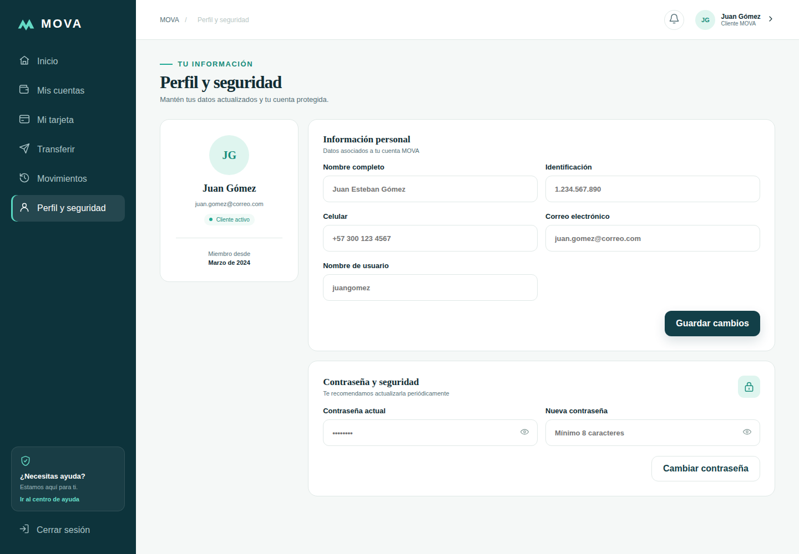
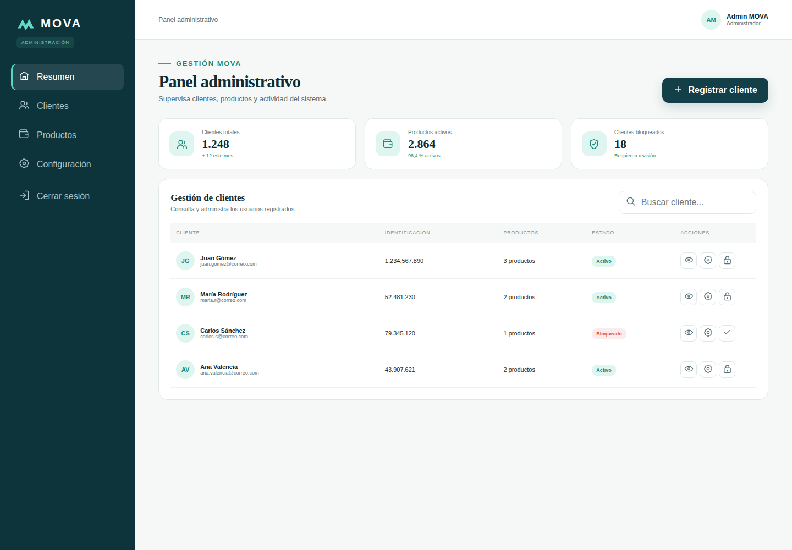

# Maqueta del proyecto — MOVA

Diseño visual de la aplicación, construido primero como prototipo en Figma Make y luego llevado a HTML, CSS y JavaScript puro (`index.html`, `styles.css`, `js/ui/*.js`). Identidad: banca digital con paleta azul petróleo (`#0D333B`) y verde azulado (`#20A995`), tipografía legible y componentes reutilizables (botones, tarjetas de producto, formularios). Diseño responsivo para escritorio, tablet y móvil.

**Flujo de navegación:** inicio → registro / inicio de sesión → panel del cliente → perfil. El administrador entra a su propio panel.

| # | Pantalla | Imagen | Historia relacionada |
|---|---|---|---|
| 1 | Inicio (landing) |  | — |
| 2 | Registro |  | HU-02 |
| 3 | Inicio de sesión |  | HU-02 |
| 4 | Resumen del cliente |  | HU-03 |
| 5 | Movimientos |  | HU-03 |
| 6 | Mis cuentas (ahorros y corriente) |  | HU-04, HU-05 |
| 7 | Mi tarjeta de crédito |  | HU-06 |
| 8 | Transferencias |  | HU-07 |
| 9 | Perfil y seguridad |  | HU-08 |
| 10 | Panel del administrador |  | HU-01 |

> Estas pantallas muestran datos de ejemplo. A medida que cada historia se conecta con la clase `Sistema`, los datos pasan a ser reales.
